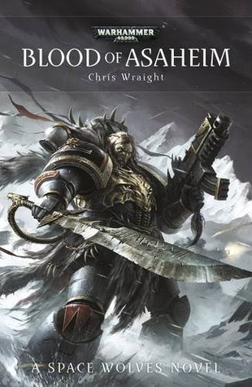

+++
title = 'Blood of Ashaheim'
date = '2025-07-19T15:31:00.006Z'
draft = false
aliases = ['/2025/07/blood-of-ashaheim.html', '/reviews/blood-of-ashaheim/']
categories = ['Reviews']
tags = ['Fantasy']
+++

I recently finished *Blood of Asaheim* by Chris Wraight and overall, I’d
say it was a solid read, though not outstanding—it’s enjoyable but
doesn’t quite break new ground.

The story follows Ingvar, a Space Wolf returning to his old pack after
decades with the Deathwatch. That setup—homecoming meets culture clashes
is the book’s strongest point. Wraight does a good job depicting the
tension: Ingvar has changed, and his battle brothers aren’t sure what to
make of him. It’s one of those character-centric arcs that hold your
attention, even when the broader plot falters.

The action is well-paced and vivid, and you get those moments of
grimdark glory interspersed with gallows humor.  If you like
atmospheric, character-first military sci‑fi, this hits the mark.   And
fans of the Wolves characterization will find plenty to enjoy.

In short: *Blood of Asaheim* is a dependable Warhammer 40k
novel—entertaining, well‑written, but not revolutionary.  Enough for
fans of the Wolves and grimdark epics, less so for those seeking
something truly memorable.
