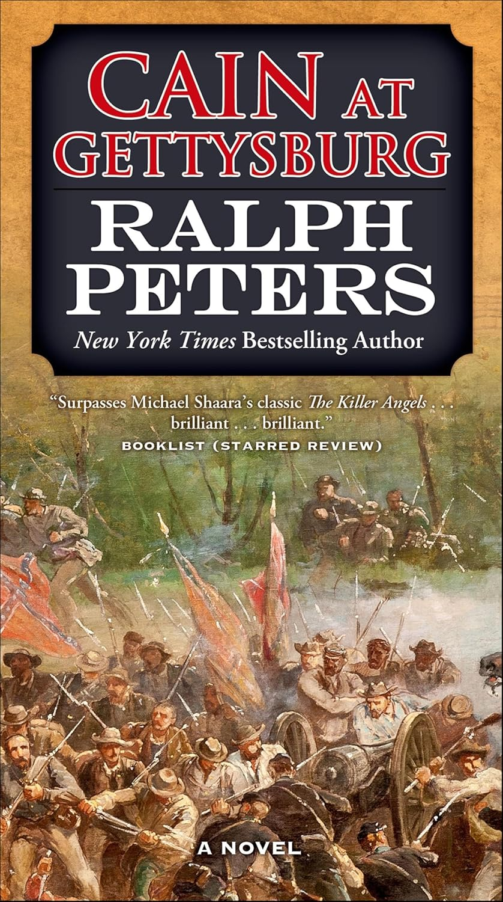

+++
title = 'Cain at Gettysburg'
date = '2026-01-31T21:40:00.002Z'
draft = false
aliases = ['/2026/01/cain-at-gettysburg.html', '/reviews/cain-at-gettysburg/']
categories = ['Reviews']
tags = ['Civil War', 'Historical Fiction']
+++

Cain at Gettysburg by Ralph Peters steps onto well-traveled ground and,
to its credit, finds a fresh path across it.

Anyone who has spent time with Civil War literature approaches another
Gettysburg novel with hesitation. The battle has been retold in
countless books and films, most famously in Michael Shaara’s "The Killer
Angels", and it’s easy to worry that a new entry will simply reshuffle
familiar scenes.

Cain at Gettysburg doesn’t.

This first installment of The Battle Hymn Cycle succeeds not by
reinventing the battle, but by reframing it. Peters shifts the focus
away from the most well-known moments and toward figures who often stand
at the edge of the better-known narratives. I especially enjoyed the
attention given to General George Meade — a commander central to the
Union victory, yet frequently overshadowed in popular memory. Seeing
Gettysburg through Meade’s perspective adds both tension and dimension
and serves as a reminder that triumph is often remembered more narrowly
than it was earned.

Peters also writes with a grounded realism. The prose feels rooted in
the period, not only in movement and maneuver, but in the emotional
weather of the men themselves. The result is a Gettysburg story that
resists spectacle and stays human.

Even with the ending already written in stone, the book feels new. The
suspense comes less from battlefield surprise and more from personal
stakes, and that shift makes the familiar terrain worth walking again.
