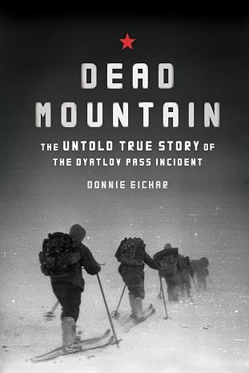

+++
title = 'Dead Mountain: The Untold True Story of the Dyatlov Pass Incident'
date = '2026-08-18T12:00:00-05:00'
draft = false
categories = ['Reviews']
tags = ['True Crime', 'Nonfiction', 'Unsolved Mysteries']
coverImage = 'cover.jpg'
+++

I have always been fascinated by mysteries that resist an easy explanation. I'm not entirely sure when I first heard about the Dyatlov Pass incident, but the underlying question of what happened has stayed with me. It connects to the kinds of stories I have been drawn to for years, from *The Reader's Digest Mystery of the Unexplained*, a book my grandmother had, to *The X-Files* in the 1990s.

*Dead Mountain: The Untold True Story of the Dyatlov Pass* by Donnie Eichar centers on the 1959 deaths of nine Soviet hikers in the remote Northern Urals. Led by Igor Dyatlov, the experienced group set out on a difficult winter trek but encountered severe weather, low visibility, and extreme cold. What followed became the mystery: their tent was cut open from the inside; they fled into the snow without the supplies and clothing, and searchers later discovered the hikers under deeply troubling circumstances.

Eichar does not simply recount the incident. He follows his own investigation as well, traveling to Russia, meeting people connected to the case, and attempting to retrace the hikers' journey. The book is ultimately about trying to explain a mystery that has endured for decades.

Eichar moves back and forth between the past and the present: one chapter brings me into the events surrounding the hikers/rescuers, and the next follows his present-day efforts to reach the site, travel through Russia, and interview people. As the book moves toward its final ideas, it spends more time in the present, building toward a possible reconstruction of what happened. I found the conclusions interesting, particularly because I had not previously heard of the infrasound hypothesis. It seemed plausible. Although, a mystery with no survivors is impossible to prove with any certainty.

Eichar's writing style made all of this easy to take in. I found the book easy to read and engaging throughout. It is a well-told story, and I had no real complaints about the reading experience. Even with the knowledge that the ultimate mystery cannot be definitively solved, the book captured my imagination.

I would recommend *Dead Mountain* to anyone who enjoys unsolved historical mysteries. I thought it was a readable, well-structured, and thoroughly engaging book—one that respects the mystery while making the search for truth just as compelling.
