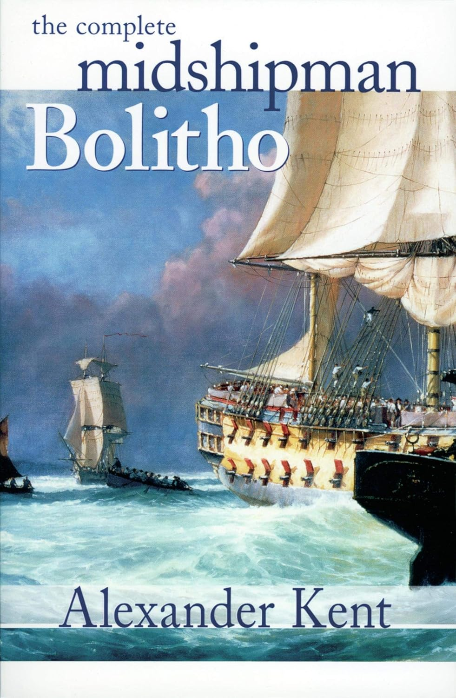

+++
title = 'The Complete midshipman Bolitho'
date = '2024-10-12T03:12:00.001Z'
draft = false
aliases = ['/2024/10/finished-reading-complete-midshipman.html', '/reviews/finished-reading-complete-midshipman/']
categories = ['Reviews']
tags = ['Historical Fiction', 'Audiobook']
+++

  
  

Finished reading "The Complete Midshipman Bolitho" by Alexander Kent. 
 This is the first book, in a series of nautical fiction novels set
during the late 18th century in the Royal Navy.   The central character
in the series is Richard Bolitho.     In researching about the book
series, I discovered, that Alexander Kent was actually a pseudonym for
Douglas Reeman.

This book is actually a compilation of the first 3 Bolitho books.

> 1\. Richard Bolitho: Midshipman 1772
> 
> 2\. Midshipman Bolitho and the Avenger 1773
> 
> 3\. Band of Brothers 1774

My father introduced me to the Bolitho books, when I was very young. 
 He had a number of books in the series, and I remember looking at the
naval scenes depicted on covers.  As a teenager, I read "The Sloop of
War", which turns out to be book 6 in the series.  

"The Complete Midshipman Bolitho" is a standard adventure type novel,
overall, an easy read, and enjoyable.     

>
