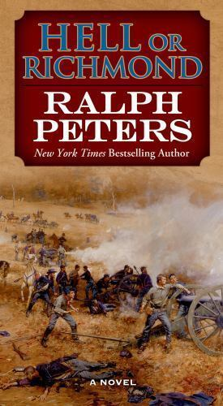

+++
title = 'Grant’s Grim Road to Richmond'
date = '2026-08-02T12:00:00-05:00'
draft = false
categories = ['Reviews']
tags = ['Civil War', 'Historical Fiction']
+++

Ralph Peters’ *Hell or Richmond* is the second novel in his Battle Hymn Cycle, following *Cain at Gettysburg*. It offers a compelling and often brutal account of Ulysses S. Grant’s Overland Campaign, told through the perspectives of the commanders and soldiers who endured it.

The novel covers the roughly thirty-day campaign that began in May 1864, moving from the tangled forests of the Wilderness through Spotsylvania Court House and the infamous Bloody Angle before reaching the disastrous Union assault at Cold Harbor. Rather than treating these battles as isolated events, Peters presents them as stages in one relentless struggle. Grant keeps moving south and attacking, while Robert E. Lee repeatedly tries to block his path and preserve the Army of Northern Virginia.

The central theme of *Hell or Richmond* is attrition. Grant understood that the Union possessed resources and manpower the Confederacy could not replace. Previous Union commanders had often withdrawn after a defeat or a failed attempt to destroy Lee’s army. Grant was different. Even when stopped tactically, he refused to end the campaign. He disengaged, moved farther south, and attacked again.

The story unfolds through multiple points of view. Historical figures such as George Meade, Robert E. Lee, Francis Barlow, and William Oates allow Peters to portray the campaign from both sides. Grant appears throughout, although readers frequently encounter him through the observations of the generals serving under him. This approach gives the novel a broad perspective while keeping the narrative grounded in individual experience.

One of Peters’ strengths is his ability to make well-known historical figures feel like human beings rather than names in a textbook. His generals are shaped by pride, exhaustion, uncertainty, and personal rivalry. Lee remains a formidable commander, but he is also an aging man trying to hold together an increasingly strained army. Meade must adjust to Grant’s presence and authority, while Grant carries responsibility for a campaign that demands almost constant sacrifice.

Readers familiar with Civil War history already know where the campaign leads, but that knowledge does not diminish the experience. The interest comes from seeing how Peters imagines the conversations, emotions, and private doubts behind the historical record. He uses fiction to explore what these men may have felt during one of the war’s most punishing campaigns.

*Hell or Richmond* is a worthy successor to *Cain at Gettysburg* and another strong entry in the Battle Hymn Cycle. I highly recommend it to anyone interested in the Civil War, particularly readers who enjoy historical fiction such as Michael Shaara’s *The Killer Angels*. Peters combines extensive historical detail with an engaging narrative, communicating both the strategic importance of the Overland Campaign and its horrifying cost.

This is not a story of one decisive victory. It is a story of endurance, arithmetic, and the grim determination to keep moving forward, no matter how much blood has already been spilled.
