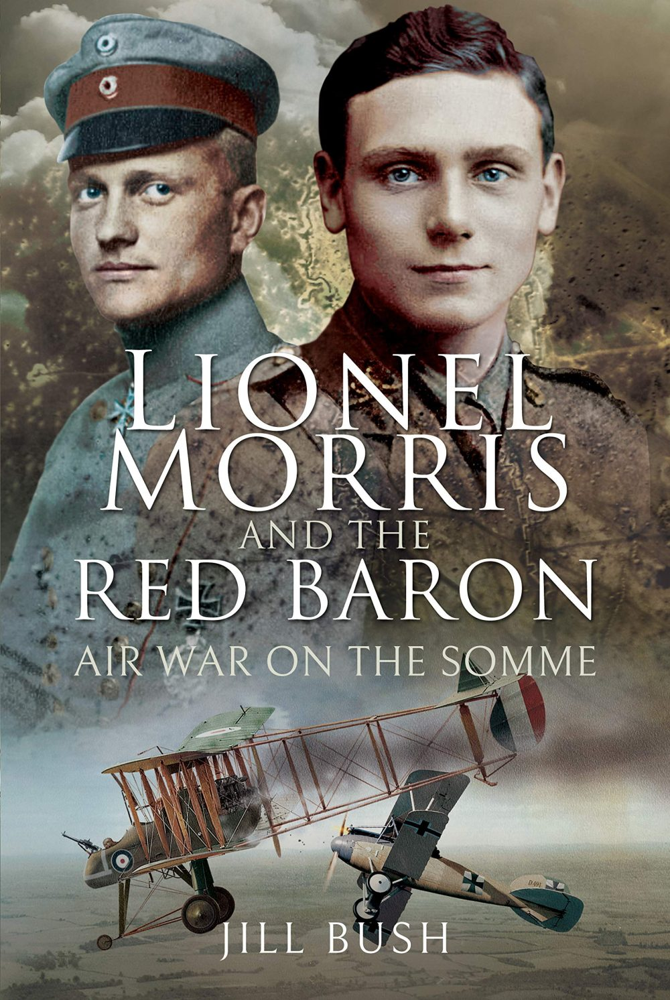

+++
title = 'Lionel Morris and the Red Barron'
date = '2025-02-02T01:46:00.001Z'
draft = false
aliases = ['/2025/02/lionel-morris-and-red-barron.html', '/reviews/lionel-morris-and-red-barron/']
categories = ['Reviews']
tags = ['WWI', 'Military History']
+++

History book about Lionel Morris by Jill Bush.

This book is about Lionel Morris, a young British pilot in World War I,
who joined the Royal Flying Corps and served on the Western Front. In
September 1916, during a battle over Bapaume, Morris's squadron was
attacked by a German unit that included Manfred von Richthofen, later
known as the Red Baron. Morris was shot down and killed, becoming
Richthofen's first confirmed aerial victory. Morris's story is a
reminder of the many unsung heroes of World War I and the human cost of
war.

The book is based on previously unpublished archive material (including
excerpts from Morris' diary), the words of contemporaries, and official
records. It traces Morris's short but extraordinary life and reveals how
his role in history was rediscovered one hundred years after his death.

Overall, the book received positive reviews, and I found the book to be
an easy read.
