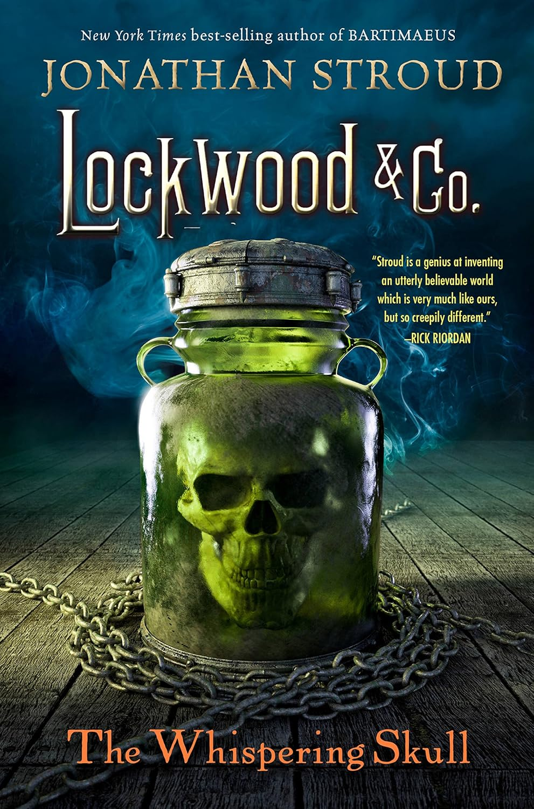

+++
title = 'Lockwood and Co -The Whispering Skull '
date = '2025-05-07T21:58:00.009Z'
draft = false
aliases = ['/2025/05/lockwood-and-co-whispering-skull.html', '/reviews/lockwood-and-co-whispering-skull/']
categories = ['Reviews']
tags = ['Fantasy', 'Young Adult']
+++

After finishing *The Screaming Staircase*, I dove straight into *The
Whispering Skull*. This book lines up with episodes 4–8 from the Netflix
adaptation, so if you’ve seen the show, you’ll recognize some of the
major moments — but the book still holds plenty of surprises. I picked
up the second installment with high expectations, and it absolutely
delivered. If anything, it felt darker, sharper, and even funnier in
places.

In this sequel, we’re back with Lucy, Lockwood, and George as they take
on an even more dangerous case involving a mysterious relic and a
powerful ghost: the titular Whispering Skull. The stakes are higher, and
the ongoing rivalry with the Fittes agency adds to the overall tension.
What really stood out for me was how we get deeper insight into George’s
quirks, Lockwood’s secrets, and Lucy’s evolving connection with the
Skull itself. Jonathan Stroud continues to nail that perfect blend of
chilling ghost story and witty banter, all wrapped in a richly imagined
world.

Now, several months after finishing the book, I finally completed the
audiobook version. This time it’s narrated by Katie Lyons, who does a
fantastic job bringing the characters to life. Her performance adds a
new layer of energy, especially with the Skull’s sarcastic
commentary. *The Whispering Skull* is the kind of sequel that builds
beautifully on what came before, while setting up even bigger mysteries
ahead. If you loved the first book (or the show), don’t miss this one.
It’s spooky, smart, and so much fun.
