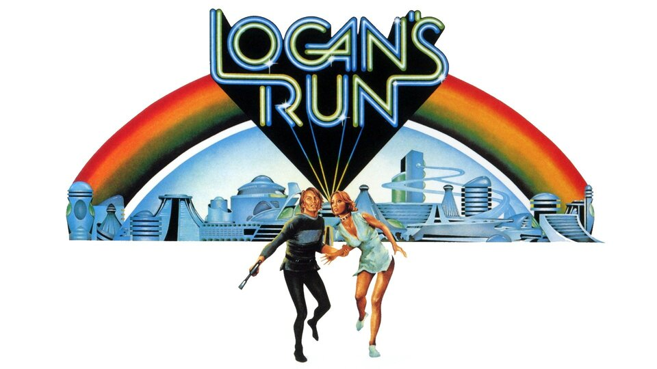

+++
title = "Logan's Run"
date = "2026-09-25T17:25:32-05:00"
draft = false
categories = ["Reviews"]
tags = ["Sci-Fi", "Books", "Movies"]
coverImage = "logans-run.jpg"
+++

I first saw Logan's Run when I was probably eight or nine years old, and the movie has stayed with me ever since. Over the years I have gone back and watched it several times, so when I recently came across the novel by William F. Nolan and George Clayton Johnson, I decided to read it.

I was curious to see just how closely the movie followed the book.

## The Same Idea, but a Different Journey

Both versions share the same basic premise: a future society controls its population by limiting how long people are allowed to live. Logan is a Sandman, responsible for hunting Runners, people who try to escape their scheduled death. As he begins questioning the system, he and Jessica, a woman with ties to the Runners, set out to find a mysterious place known as Sanctuary.

The first major difference is age. In the novel, everyone is expected to die at 21, while the 1976 movie raised that age to 30.

From there, the stories diverge. The novel becomes a cross-country journey through what remains of the United States. The movie brings Logan and Jessica to the ruins of Washington, D.C., where they meet the Old Man, played by Peter Ustinov.

My biggest surprise was that Carousel, the ceremony I most strongly associate with Logan's Run, was essentially created for the film. Citizens reaching 30 float into the air before a cheering crowd, hoping to be "renewed" rather than destroyed. That scene fascinated me as a kid, and the novel has nothing like it. Lastday, the day a citizen's lifespan ends, is handled differently.

The novel also includes episodes the movie leaves out entirely. The one that stood out most to me is a recreation of the Civil War Battle of Fredericksburg, presented as an example of young soldiers willingly sacrificing their lives for something larger than themselves. That takes on extra weight in a society where young people are taught that dying at 21 is simply their duty.

I won't go much further than that, because both versions are better experienced without knowing exactly where they are going.

## Book or Movie?

I enjoyed the novel quite a bit, but reading it did not replace the movie for me.

They really feel like two interpretations of the same idea.

The movie remains something I have a lot of nostalgia for. Its sets, visual style, Carousel sequence, and vision of the future made a huge impression on me when I was young.

The novel expands the world considerably and takes Logan and Jessica on a much larger journey. It also gives you a very different perspective on the society and the reasoning behind its obsession with youth and death.

It was familiar enough to immediately feel like Logan's Run, while being different enough that I never felt like I was simply reading the movie I already knew.
