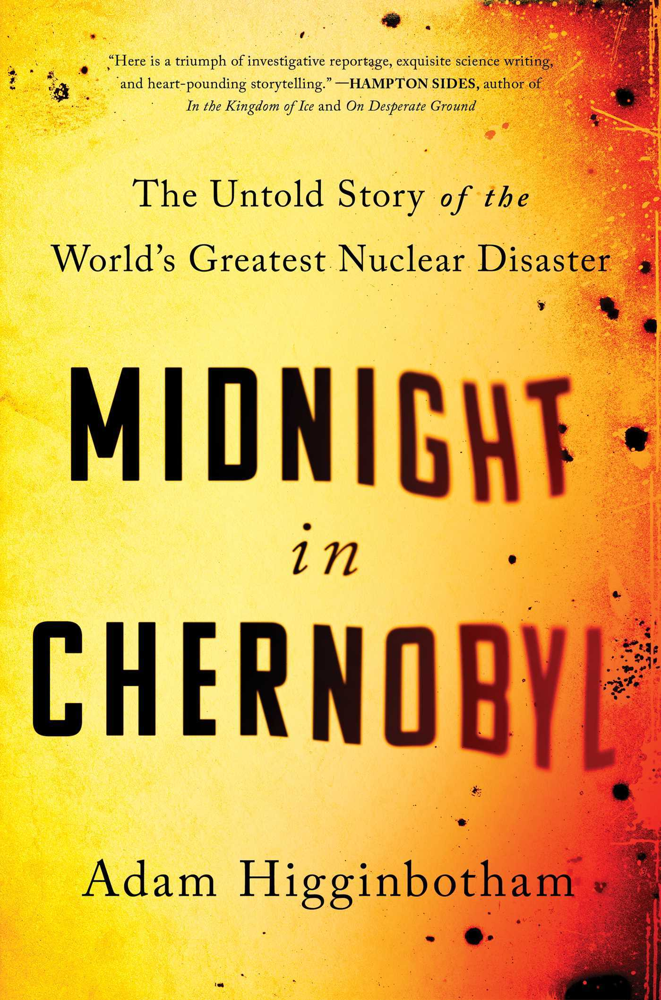

+++
title = 'Midnight at Chernobyl'
date = '2025-02-23T03:18:00.001Z'
draft = false
aliases = ['/2025/02/midnight-at-chernobyl.html', '/reviews/midnight-at-chernobyl/']
categories = ['Reviews']
tags = ['History', 'Non-Fiction']
+++

A couple of weeks ago, I came across a number of video posts from the
HBO, docudrama for Chernobyl, I had forgotten how good it was overall,
and so Sergio and I, sat down to watch again.   After watching, I was
interested in more, and this book "Midnight in Chernobyl" was one I had
long considered getting on Audible. 

Funny thing, a couple of days later, I am looking at Spotify and notice
that we now have access to a number of free audiobooks, and this was one
of them.  

*Midnight in Chernobyl* by Adam Higginbotham is a masterfully researched
and gripping account of the 1986 Chernobyl disaster. With a journalist’s
precision and a storyteller’s flair, Higginbotham brings to life the
human drama behind the catastrophe, painting a vivid picture of the
individuals who lived through it.

Beyond the disaster itself, *Midnight in Chernobyl* explores the broader
implications of Soviet secrecy, bureaucratic dysfunction, and the human
cost of political ideology.   *Midnight in Chernobyl* is not just a book
about a nuclear meltdown it’s an illuminating and deeply human account
of one of history’s most haunting events.  Highly recommended for anyone
interested in the history of Chernobyl.   

Back to Spotify, I was originally going to sing the praises of Spotify,
they not only had this book, but a large number of books that I am
extremely interested in, again all free.   Seems too good to be true,
and in a way, it is, due to their licensing agreement, they limit an
account to 15 hours of listening per month.  Which is extremely
annoying, here it is 6 days till the end of the month, and I have
already used all my time for the month.   I finished this book just
before I hit my limit for the month.   Still a good deal, but now that I
know the limits (about 1 book per month), rather than multiple like I
was doing.   Guess I can't get ride of Audible like I thought I might
have been able to.
