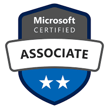

+++
title = 'Non Book Related Post Here'
date = '2024-12-20T02:38:00.001Z'
draft = false
aliases = ['/2024/12/non-book-related-post-here.html']
tags = ['Certification']
+++

Non-book related post here.   Earned my AZ-104 Azure Administrator
Associate certification exam today.   Happy to say I passed.   I wanted
to pass some of what I used for studying.   First, for a while now I
have been watching videos by John Savill on YouTube.    The following
video gives a good high-level overview of all the topics covered in the
exam ([AZ-104 Administrator Associate Study Cram
v2](https://www.youtube.com/watch?v=0Knf9nub4-k)).   The second thing I
used, is the following training material by Ravikiran Srinivasulu
([AZ-104 PRACTICE TEST w/ Labs | Microsoft Azure Administrator |
Udemy](https://www.udemy.com/course/az-104-microsoft-azure-administrator-practice-test-questions/?srsltid=AfmBOoo_NGasv4F8CeRPfxOktBJ_TxQAOVYxAR6eQ_hInkjZnRs4ErJ2&couponCode=ST21MT121624)). 
Ravi, goes over 150 exam type questions, explaining the answers in
detail, and doing live demonstrations.    Finally, I used additional
YouTube videos by Jaspal Singh ([Azure Administrator Weekend Exam Cram |
75 New Questions with explanation \#az104
\#azureadministrator](https://www.youtube.com/watch?v=fpn-T9fgLaY&t=11191s)).  
 He has numerous exam cram videos where he goes over real exam
questions, in detail.   I watched 3, videos with over 200 questions,
there were several questions I recognized on the exam.   He is
constantly updating and adding new questions.   All were very helpful,
and like I said helped me pass the exam.
