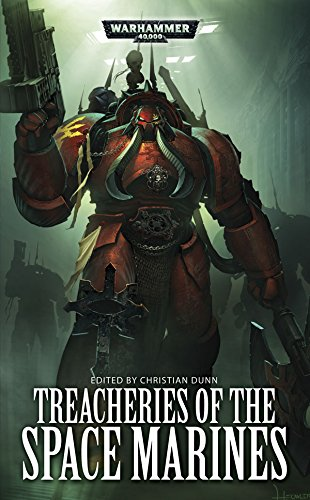

+++
title = 'Treacheries of the Space Marines'
date = '2024-12-31T00:23:00.001Z'
draft = false
aliases = ['/2024/12/reading-warhammer-40k-book-treacheries.html', '/reviews/reading-warhammer-40k-book-treacheries/']
categories = ['Reviews']
tags = ['Warhammer 40k', 'Sci-Fi']
+++

  
 Finished reading the Warhammer 40k book, Treacheries of the Space
Marines.  The book is a collection of short stories, by a number of
authors writing about the Chaos Space marines.   Those marines that
turned traitors, in the Horus Heresy.    Now 10k in the future from
those times, these traitor marines continue their fight against the
imperium of man.

Overall, a good collection of stories, with obviously some better than
others.   My two favorites are:

  - We Are One by John French
  - Vox Dominus by Anthony Reynold

I like both for different reasons.   In "We Are One", the story is from
the point of view of an Imperial Inquisitor, and his pursuit of a
traitor, across a century.   In the end, his plans come to naught when
the Alpha Legion turns the tables at the very end.

The other story "Vox Dominus", Chaos shows its true colors, the
battleship Vox Dominus disappears in the warp, when it returns it looks
like it has been gone for centuries.   When the Word Bearers board the
ship, it is infested by spawns of Nurgle.
