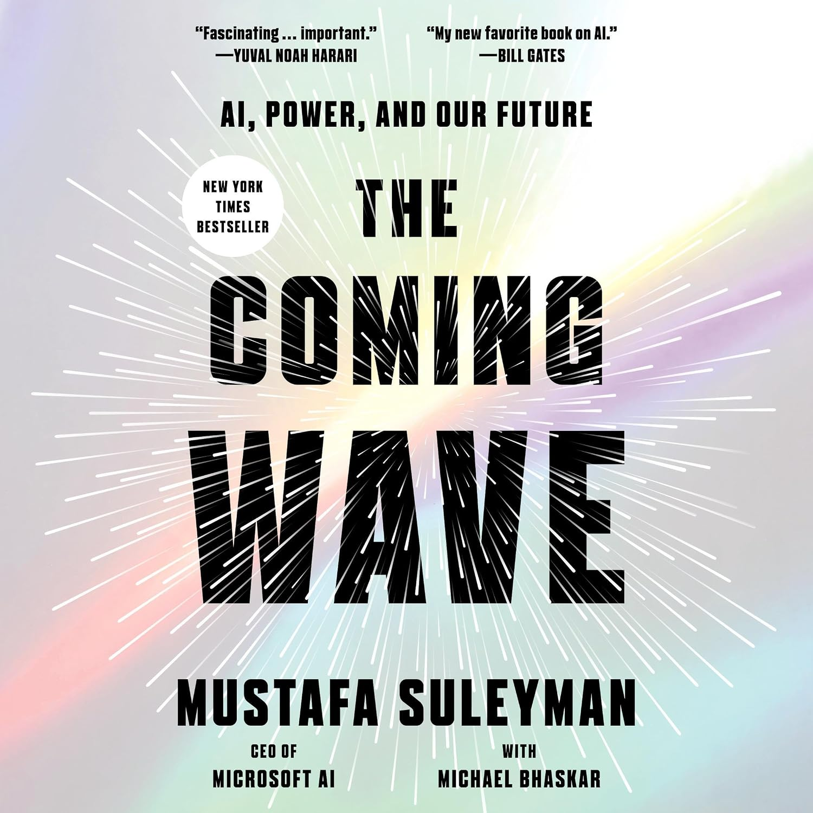

+++
title = 'The Coming Wave by Mustafa Suleyman and Michael Bhaskar'
date = '2026-10-08T21:00:00-05:00'
draft = false
categories = ['Reviews']
tags = ['AI', 'Non-Fiction', 'Technology']
coverImage = 'cover.jpg'
+++

The Coming Wave by Mustafa Suleyman and Michael Bhaskar is a thought-provoking look at the rapid advancement of artificial intelligence and other emerging technologies, and the challenges involved in trying to control them.

Suleyman makes a compelling case that these technologies are becoming increasingly powerful, widely available, and difficult to contain. Where I found myself less convinced was in his proposed solution. Many of his ideas around safety, oversight, and regulation are reasonable, but taken together they seem to require a level of cooperation between companies, governments, researchers, and the public that feels somewhat utopian.

What I found most interesting was realizing how much my own thinking about AI has shifted. I would not have described myself this way a few years ago, but I increasingly find myself sympathetic to the AI accelerationist side of the debate. That does not mean ignoring the risks, but I am becoming less convinced that broadly slowing AI development is either realistic or desirable.

Overall, I found The Coming Wave well worth reading, even though I did not agree with all of its conclusions. For me, the more interesting question is no longer whether we can contain the coming wave entirely, but how we manage the risks while continuing to move forward.
