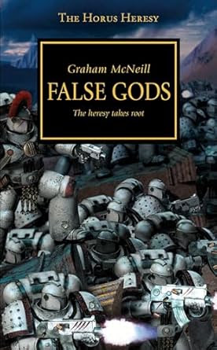

+++
title = 'False Gods'
date = '2024-11-27T21:11:00.004Z'
draft = false
aliases = ['/2024/11/continuing-to-listen-to-horus-heresy.html']
+++

  
Continuing to listen to the Horus Heresy series.  This time with the
second book in the series "False Gods".   Again, this book is read by
the English Actor Toby Longworth.  Toby's performance is top notch and
bringing to life the characters and the grim future.  

The novel continues the saga of Warmaster Horus and his legion, the Sons
of Horus, as they navigate the complexities of loyalty, power, and the
corrupting influence of Chaos.  The story picks up a few months after
the events of "Horus Rising," with Horus battling both external enemies
and his own inner demons

Overall, "False Gods" is a compelling continuation of the series,
fast-paced, with lots of exciting moments.   Again, I thoroughly
enjoyed, the audible performance and highly recommend it.
