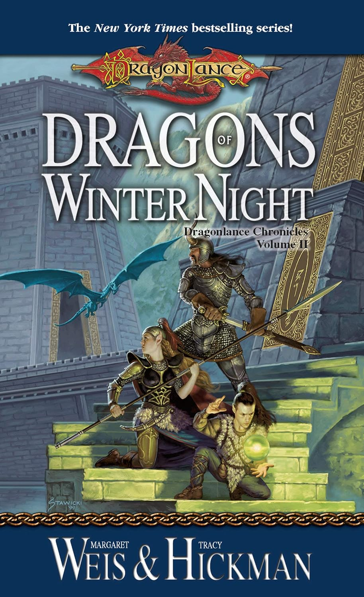
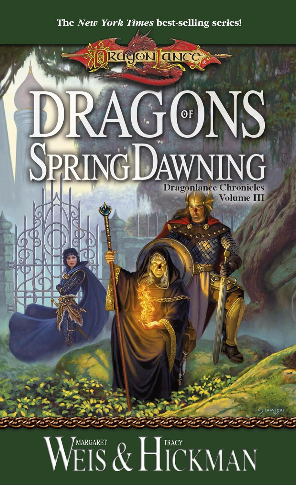

+++
title = 'Dragon Lance Novels'
date = '2025-11-14T03:32:00.001Z'
draft = false
aliases = ['/2025/11/dragon-lance-novels.html']
+++

I recently revisited two books from my past: Dragons of Winter Night and
Dragons of Spring Dawning, and this time around I chose to experience
them differently as audiobooks. The narrator, Paul Boehmer, delivered a
great performance, and I very much enjoyed the chance to revisit both
stories.

I read both books a long time ago, so a lot of the details had slipped
my mind. Listening allowed me to pick up things I had forgotten — small
scenes, character beats, world-building details that faded with time.

**Dragons of Winter Night** felt like stepping back into a landscape
that’s both familiar and slightly changed. The stakes were high, the
tone darker, and a lot of what I remembered from my youth—heroic
camaraderie, epic battle scenes, the sense of turning tides—was still
there. 

**Dragons of Spring Dawning**, meanwhile, wrapped up the trilogy and
brought things to a head. Re-listening, I realized how much of the story
I had forgotten. Some plot points felt more rushed than I remembered.
 But the revisiting also brought a sense of nostalgia, of reconnecting
with old characters and their journeys.

If you’re like me — someone who read these long ago and carries vague
impressions of them — revisiting them via audiobook might be worth it.
The narrator’s performance, in this case, brought fresh life to the
story. And getting reacquainted with these characters after so long felt
almost like visiting old friends.
