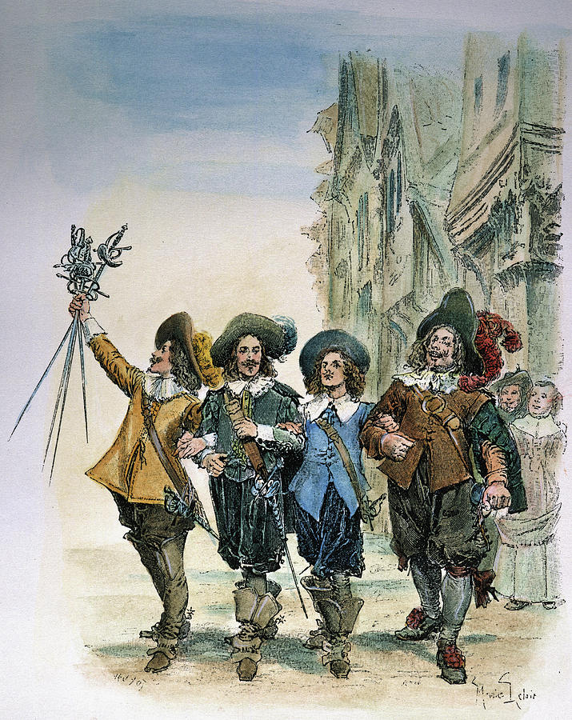

+++
title = 'The Three Musketeers'
date = '2024-10-22T17:26:00.002Z'
draft = false
aliases = ['/2024/10/finished-listening-to-audible-original.html']
+++

Finished listening to the Audible Original Drama of the Three
Musketeers.   This was a fully dramatized audio book, with 39 actors
bringing to life the characters of D'Artagnan, Athos, Porthos and
Aramis.  While the dramatization is not a 100% faithful retelling of the
Alexander Dumas classic, it is still very well done and very
entertaining.

This was one of those audible books, that once I started, I wanted to
keep listening to, until complete.
