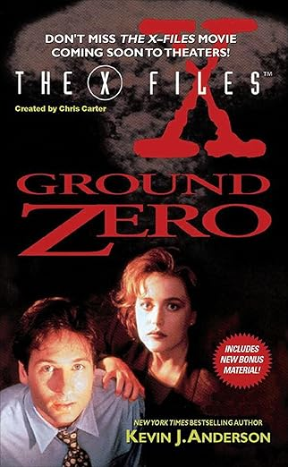

+++
title = 'Ground Zero'
date = '2024-11-24T02:51:00.002Z'
draft = false
aliases = ['/2024/11/finished-reading-ground-zero-third-book.html']
+++

Finished reading Ground Zero, the third book based in the X-File
universe.   It is a novel written by Kevin J. Anderson, based on the
popular TV series "The X-Files." The story follows FBI agents Mulder and
Scully as they investigate a series of mysterious deaths involving
radioactivity.

My Father and I started watching the X-Files, back in the early 90's
(1993 to be exact).    It became our Friday night entertainment, until
moving to Sunday night in 1996.   I have now introduced my own son to
the X-Files all these years later.   

The book itself is all-right.   It's not the best book I have ever read,
but it was fun to revisit the X-Files universe.  The book does a good
job of capturing the eerie atmosphere of the X-Files. Anderson's writing
is solid, and he does a good job of developing the characters and the
plot. However, the book is somewhat predictable, and the ending is a bit
rushed.
