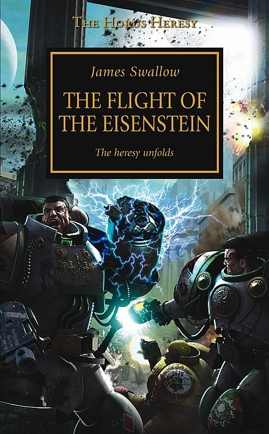

+++
title = 'Flight of the Eisenstein'
date = '2025-03-24T18:06:00Z'
draft = false
aliases = ['/2025/03/flight-of-eisenstein.html']
+++

**“Flight of the Eisenstein” by James Swallow**

Catching up on some reviews...   I mentioned this one back in January,
and just saw, that I haven't posted about it yet, so here it is.   I’ve
been working my way through the *Horus Heresy* series on audiobook
lately and after wrapping up *Galaxy in Flames*, I jumped straight into
*Flight of the Eisenstein* by James Swallow.

First off, new narrator for this book, Jonathan Keeble who was also very
good, and brings that weight and gravity to the story that makes you
feel like you're right there in the chaos.

This book follows Garro—Nathaniel Garro of the Death Guard— precedes
some of the story happening in Galaxy in Flames, before intersecting at
a key moment, and then continuing on the Eisenstein’s flight from
Isstavan III, back to earth, through the warp.  

I won't go into too much detail, just say that the book is one of my
early favorites, from the first group of novels.
