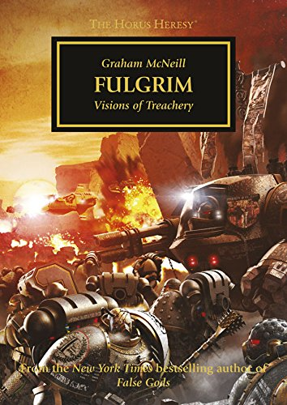

+++
title = 'Fulgrim'
date = '2025-06-11T20:58:00Z'
draft = false
aliases = ['/2025/06/fulgrim.html']
+++

> > 

Fulgrim is the next haunting and operatic tale in the Horus Heresy
series. In this installment, Graham McNeill takes us deep into the
psyche of the primarch Fulgrim and his III Legion, the Emperor’s
Children, as they descend from noble warriors in pursuit of perfection
to corrupted champions of excess under the sway of Chaos. The book
vividly captures this transformation, weaving a narrative that spans
stunning victories, eerie discoveries, and the fateful events at Isstvan
V.

This audiobook is narrated by David Timson, who brings gravitas and
elegance to the story—perfectly suited to Fulgrim’s tragic arc. His
performance enhances the theatrical tone of the novel, breathing life
into both the grandeur and the madness that overtakes the Emperor’s
Children. Fulgrim stands out as one of the more disturbing and memorable
entries in the series—an essential chapter that shows just how far a
primarch can fall when perfection turns to obsession.
