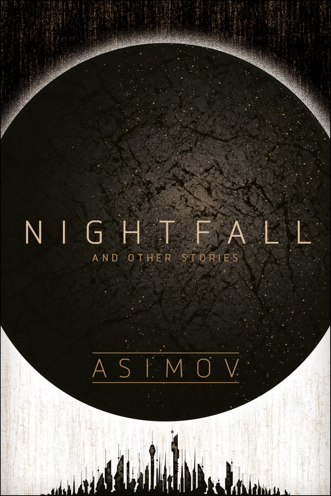

+++
title = 'Nightfall'
date = '2024-10-06T03:04:00.004Z'
draft = false
aliases = ['/2024/10/i-read-nightfall-and-other-stories-by.html']
+++

  
 I read Nightfall and other stories by Isaac Asimov, back when I was a
teenager (so 30 some years ago).   This time around, I finished
"reading" this book again, this time as an audio book, from Audible.  

Nightfall and other stories is a collection of 20 stories, compiled by
Asimov himself, who prefaced each story with an introduction.   The
first story is “Nightfall”, the tale of a world ordinarily illuminated
by sunlight at all times.   Darkness only happens once every 2000
years.   This is the one story I remembered from the first time I read
it, and it still one of the greatest science fiction stories of all
time. 

There were a couple of other stories, that I really enjoyed.   Several
of the highlights were:

  - In A Good Cause
  - It's Such a Beautiful Day
  - The Machine That Won the War

The narration by Jon Lindstrom was engaging and made the "re-reading"
the book an enjoyable experience.   

The Science Fiction Writers of America voted Nightfall as the best
science-fiction short story ever written.
