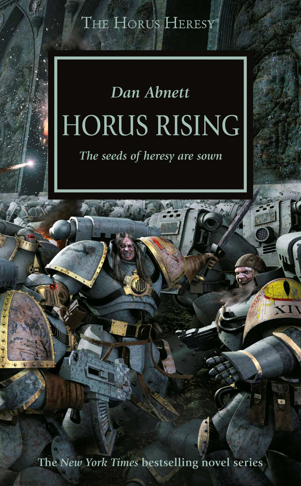

+++
title = 'Horus Rising'
date = '2024-11-02T01:35:00.005Z'
draft = false
aliases = ['/2024/11/i-was-introduced-to-world-of-warhammer.html']
+++

  

I was introduced to the world of Warhammer 40k (from Games Workshop), as
a freshman in college.   I played the tabletop game and collected
figurines.   Many years later I stumbled upon the fiction published by
Games Workshop, Black Library division.   Their immersive fiction
spanned the Warhammer universe which takes place 40k in the far future. 
Then in 2016, they started publishing some of the historical events that
shaped that universe.    The seminal event in this universe is the Horus
Heresy which occurred 10k earlier.   This is where the Warmaster Horus,
one of the emperor's sons, betrays him, leading to a brutal civil war
between the loyalist and traitor factions

This is the first book of the series (at the time of this posting there
are 54 in total).   I read originally read this book back at the time of
publishing, this time though, and the reason I am posting a review is
that I got the audio book and just finished listening to it.   The book
is read by Toby Longworth, an English actor, and he is amazing.  I
throughly enjoyed his performance and highly recommend it.   One note,
though, the Warhammer 40k universe is a grim, bleak and brutal.
