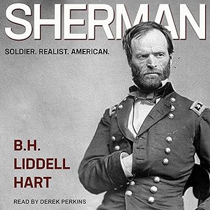

+++
title = 'Sherman: Soldier, Realist, American'
date = '2025-12-28T01:40:00Z'
draft = false
aliases = ['/2025/12/sherman-soldier-realist-american.html']
+++

I’ve always found William Tecumseh Sherman to be one of the most
interesting figures of the American Civil War not just because of his
marches and battles, but because he changed the way people thought about
war itself. 

First off, this isn’t a modern book. It was written in 1929, that older
lens gives the narrative a very different feel compared to contemporary
histories.  The audiobook narration does a great job of letting that
voice come through without feeling dated or dull.

What struck me most about the book is its treatment of Sherman not just
as a soldier, but as a realist someone who looked at the nature of
conflict with clear eyes and wasn’t afraid to draw the logical
conclusions of what war meant in the modern era. Liddell Hart’s premise
is that Sherman’s campaigns, particularly the march through Georgia and
the Carolinas, were a kind of precursor to the way total war would be
fought in the 20th century focusing on mobility, disruption of
infrastructure, and psychological impact as much as traditional
battlefield engagements.

If I have one minor quibble, it’s that the book doesn’t delve as deeply
into Sherman’s post-war life as some listeners might like. The focus
stays tightly on the soldier and strategist, which is fine by me, but
worth noting if you’re hoping for a full life story rather than
primarily a military one.

All told, *Sherman: Soldier, Realist, American* was a thoroughly
engaging listen. If you’re intrigued by Sherman’s role in the Civil War
— especially as a pioneer of modern military thinking — and you enjoy
audiobooks that make you think as much as they inform, this one’s well
worth your time.
