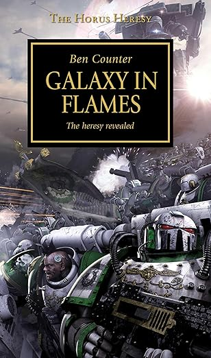

+++
title = 'Galaxy in Flames'
date = '2025-01-31T19:31:00.004Z'
draft = false
aliases = ['/2025/01/was-getting-ready-to-post-about-several.html']
+++

  
 I was getting ready to post about several books and audio books, I
finished in the last week, one being The Flight of the Eisenstein, when
I realized that I had not posted anything about the preceding book,
Galaxy in Flames.

Galaxy in Flames is the third book in the Horus Heresy series by Ben
Counter.  The book opens with Horus, Warmaster of the Imperium's forces,
seemingly leading an expedition to punish the rebellious Governor of
Isstvan III. Four Legions of Space Marines are sent: the Sons of Horus
(Horus's own Legion), the World Eaters, the Emperor's Children, and the
Death Guard. These Legions, unbeknownst to the loyalist elements within
them, have already been corrupted by Chaos and secretly pledged
themselves to Horus's rebellion.

The loyalist elements from these 4 legions are sent to Isstvan III,
where Horus orders the planet bombed with planet killing Virus bombs.   

Again, this book is read by the English Actor Toby Longworth, and as I
have said before his performance is excellent.    Again overall,
recommened.
